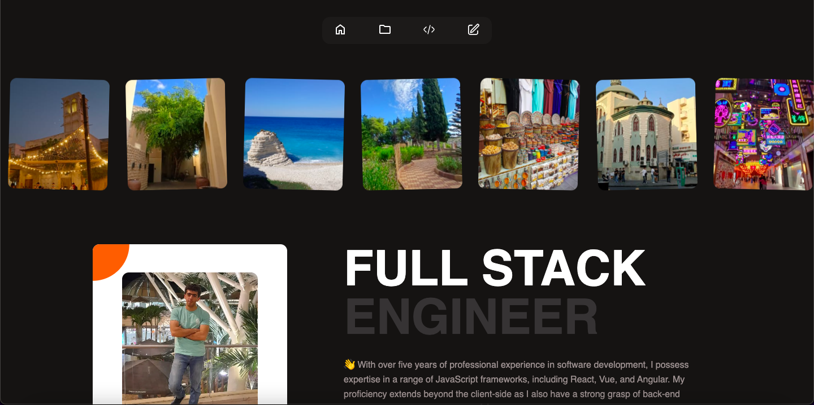

# 🌐 Puzant's Portfolio

## Preview

## ✨ Features  
- **About Me**: A brief introduction to who I am and my professional background.  
- **Skills**: A detailed list of my technical and personal skillset.  
- **Recent Projects**: A showcase of my latest projects with descriptions and links.  
- **Recent Publications**: Highlights of my published work, articles, or blog posts.  
- **Contact Section**: Easy ways to get in touch with me.  

## 🛠️ Built With  
- **Vue.js**: For creating a dynamic and interactive user experience.  
- **Sass**: For clean and maintainable styling with advanced CSS features.  

**📷 Demo**: [Puzant Portfolio](http://puzant.netlify.app/)
